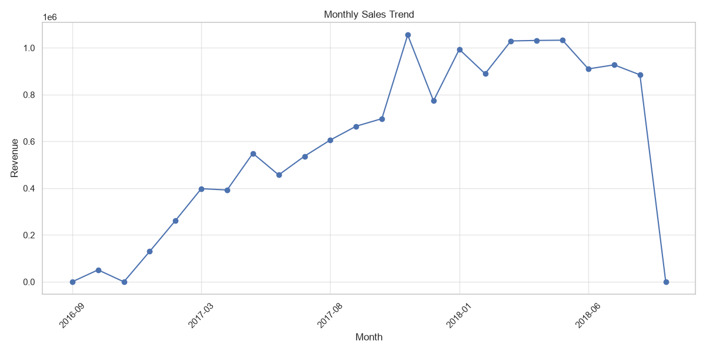
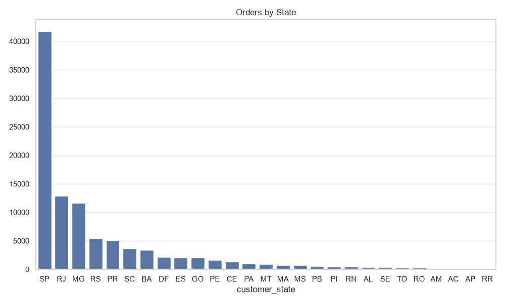
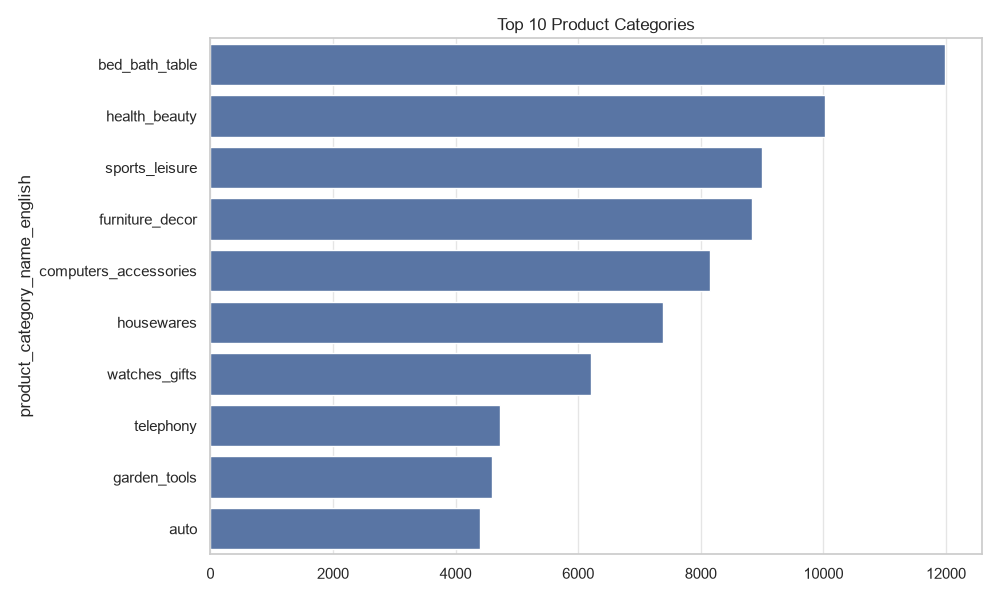
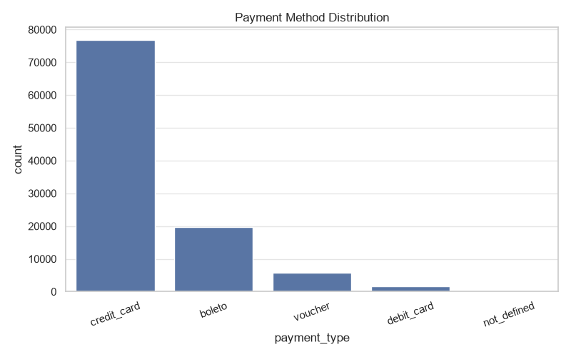
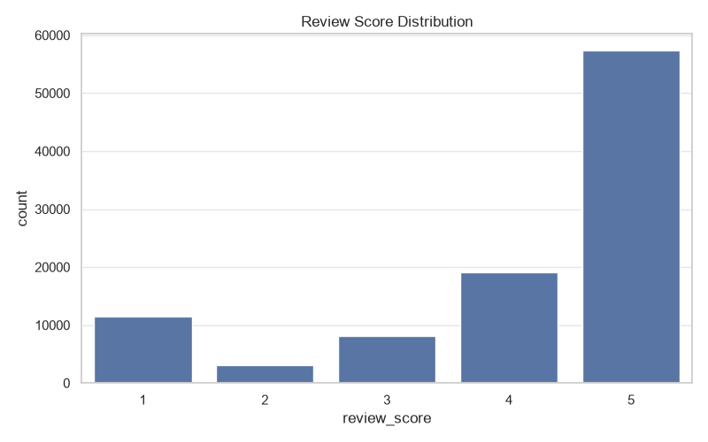

# 📊 E-commerce Sales Analysis


---

## 📖 Project Overview

This project performs an end-to-end analysis of the **Brazilian Olist E-commerce Public Dataset (Kaggle)** to uncover valuable business insights.

The workflow includes **data cleaning, exploratory data analysis (EDA), SQL-based business analysis, data visualization, and business reporting**.

The goal of this project is to demonstrate an end-to-end data analytics workflow—from raw data preprocessing and exploratory analysis to SQL-based business insights and visualization—using real-world e-commerce data.

---

## ✨ Features

- Data Cleaning & Preprocessing
- Exploratory Data Analysis (EDA)
- SQL Business Analysis
- Business Insights Generation
- Data Visualizations
- SQLite Database Integration
- Business Report Documentation
- Version Control using Git & GitHub

---

## 📂 Dataset

**Dataset:** Brazilian Olist E-commerce Public Dataset (Kaggle)

The dataset consists of multiple relational tables, including:

- Customers
- Orders
- Order Items
- Payments
- Reviews
- Products
- Sellers
- Geolocation
- Product Category Translation

---

## 🛠️ Technologies Used

- Python
- Pandas
- NumPy
- Matplotlib
- Seaborn
- SQLite
- SQL
- Jupyter Notebook
- Git
- GitHub

---

## 📁 Project Structure

```text
ecommerce-sales-analysis/
│
├── data/
│   ├── raw/
│   └── cleaned/
│
├── database/
│
├── notebooks/
│   ├── 00_data_understanding.ipynb
│   ├── 01_data_cleaning.ipynb
│   ├── 02_eda.ipynb
│   └── sql_analysis.ipynb
│
├── reports/
│   └── business_report.md
│
├── sql/
│   └── ecommerce_analysis.sql
│
├── visuals/
│   ├── monthly_sales.png
│   ├── orders_by_state.png
│   ├── payment_methods.png
│   ├── review_distribution.png
│   └── top_categories.png
│
├── .gitignore
├── load_to_sqlite.py
├── main.py
├── README.md
└── requirements.txt
```

---

## 📈 Analysis Performed

### 🧹 Data Cleaning

- Handled missing values
- Removed duplicate records where applicable
- Converted date columns to datetime format
- Standardized datasets for analysis

### 📊 Exploratory Data Analysis (EDA)

- Monthly Sales Trend
- Revenue Analysis
- Product Category Performance
- Customer Purchase Behaviour
- Payment Method Distribution
- Delivery Performance
- Review Score Analysis

### 🗃️ SQL Analysis

A collection of **23 business-focused SQL queries** was written using SQLite to answer key business questions.

The analysis covers:

- Revenue Analysis
- Customer Behaviour
- Product Performance
- Seller Performance
- Payment Preferences
- Delivery Performance
- Customer Reviews
- Monthly Revenue Growth

SQL concepts demonstrated include:

- JOIN
- GROUP BY
- Aggregate Functions
- CASE Statements
- Common Table Expressions (CTEs)
- Window Functions (`LAG`)

---

## 📊 Visualizations

### Monthly Sales Trend

Shows how revenue changes over time.



---

### Orders by State

Distribution of customer orders across Brazilian states.



---

### Top Product Categories

Top 10 most frequently purchased product categories.



---

### Payment Method Distribution

Distribution of customer payment methods.



---

### Review Score Distribution

Distribution of customer review ratings.



---

## 💡 Key Business Insights

- Credit cards dominate customer transactions, making them the preferred payment method.
- Most customers placed only one order, highlighting opportunities to improve customer retention.
- Product categories such as **Bed Bath & Table**, **Health & Beauty**, and **Sports & Leisure** generated the highest order volumes.
- Customer reviews are predominantly positive, indicating a generally satisfying shopping experience.
- Delivery performance appears to influence customer satisfaction and review scores.
- Sales showed strong growth throughout the observed period before stabilizing.

---

## 📌 Project Highlights

- Cleaned and analyzed multiple relational datasets.
- Built an SQLite database for business analysis.
- Wrote **23 business-oriented SQL queries**.
- Generated insightful visualizations using Matplotlib and Seaborn.
- Created reusable Jupyter notebooks for each stage of the workflow.
- Documented the project with a detailed business report.

---

## 🚀 How to Run the Project

### 1. Clone the repository

```bash
git clone <repository-url>
```

### 2. Install dependencies

```bash
pip install -r requirements.txt
```

### 3. Open Jupyter Notebook

Run the notebooks in the following order:

1. `00_data_understanding.ipynb`
2. `01_data_cleaning.ipynb`
3. `02_eda.ipynb`
4. `sql_analysis.ipynb`

---

## 📄 Business Report

A detailed project report is available in:

```text
reports/business_report.md
```

---

## 🔮 Future Improvements

- Interactive Power BI Dashboard
- Tableau Dashboard
- Sales Forecasting
- Customer Segmentation using Machine Learning
- Recommendation System
- Deployment as an interactive analytics application

---

## 👩‍💻 Author

**Anushka Rauniyar**

B.Tech Information Technology  
Manipal University Jaipur

---

⭐ **If you found this project helpful, consider giving it a star!**